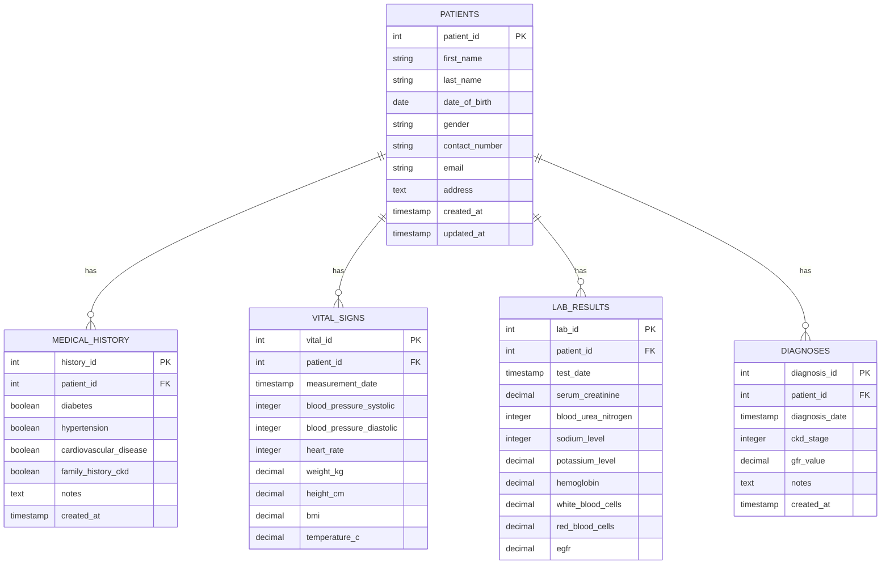

# Entity Relationship Diagram

```mermaid
erDiagram
    PATIENTS ||--o{ MEDICAL_HISTORY : has
    PATIENTS ||--o{ VITAL_SIGNS : has
    PATIENTS ||--o{ LAB_RESULTS : has
    PATIENTS ||--o{ DIAGNOSES : has
    
    PATIENTS {
        int patient_id PK
        string first_name
        string last_name
        date date_of_birth
        string gender
        string contact_number
        string email
        text address
        timestamp created_at
        timestamp updated_at
    }
    
    MEDICAL_HISTORY {
        int history_id PK
        int patient_id FK
        boolean diabetes
        boolean hypertension
        boolean cardiovascular_disease
        boolean family_history_ckd
        text notes
        timestamp created_at
    }
    
    VITAL_SIGNS {
        int vital_id PK
        int patient_id FK
        timestamp measurement_date
        integer blood_pressure_systolic
        integer blood_pressure_diastolic
        integer heart_rate
        decimal weight_kg
        decimal height_cm
        decimal bmi
        decimal temperature_c
    }
    
    LAB_RESULTS {
        int lab_id PK
        int patient_id FK
        timestamp test_date
        decimal serum_creatinine
        integer blood_urea_nitrogen
        integer sodium_level
        decimal potassium_level
        decimal hemoglobin
        decimal white_blood_cells
        decimal red_blood_cells
        decimal egfr
    }
    
    DIAGNOSES {
        int diagnosis_id PK
        int patient_id FK
        timestamp diagnosis_date
        integer ckd_stage
        decimal gfr_value
        text notes
        timestamp created_at
    }
```